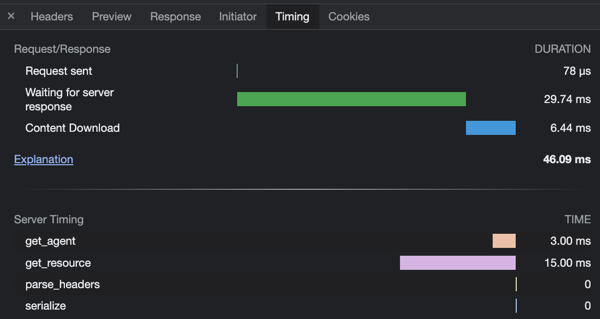

# simple-server-timing-header
[](https://crates.io/crates/simple-server-timing-header)
[](https://docs.rs/simple-server-timing-header)

Lightweight zero-dependency Rust crate that adds a `Server-Timing` header to the response of a request.

```rust

use simple_server_timing_header::Timer;

fn handle_request() {
    let mut timer = Timer::new();
    // ... do some stuff
    timer.add("parse_headers");
    // ... do some more stuff
    timer.add("get_db_data");
    // Sets the `Server-Timing: parse_headers;dur=0.1, get_db_data;dur=0.2` header
    add_header(timer.header_key(), timer.header_value());
}
```


